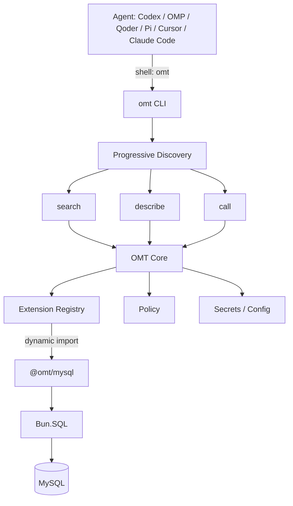

# Oh My Tool（OMT）

> **Bun Runtime + TypeScript Core + 同进程 Extension + Progressive Discovery**

OMT 是一个面向 **Agent（Codex / OMP / Qoder / Pi / Cursor / Claude Code）** 的本地与企业工具入口。Agent 只需要一份 Skill 学会 `omt search` → `omt describe` → `omt call`，即可渐进式发现并使用能力（MySQL、Redis、Nacos、AIOps……）。第一版只实现 **MySQL**，把扩展机制先跑通。

## 核心模型



## 设计原则

- **OMT Core 不拥有能力，只管理能力。** Core 不认识 MySQL/Redis，只认识 Extension/Tool/Manifest/Input/Output/Policy/Secrets。
- **Extension 拥有能力，但不管理 Agent。**
- **Agent 不知道 Extension，只知道 OMT。**
- **Manifest 用于发现，Extension 只在执行时加载。** `search` 只扫 Manifest，不启动扩展；`call` 才 `dynamic import`。

## 仓库结构

核心 monorepo（Bun workspace）与能力独立仓库分开。

```text
oh-my-tool/
├── packages/
│   ├── sdk/        @oh-my-tool/sdk      类型 + defineExtension + ToolError + OMT_API_VERSION
│   └── cli/        @oh-my-tool/cli      omt 命令
│       ├── assets/skills/oh-my-tool/     CLI 发布包内置 Skill（唯一发布源）
│       └── src/
│           ├── cli/       命令入口 + commands/
│           ├── core/      registry / loader / executor / schema / result
│           ├── extension/ discovery / manifest / install
│           ├── integration/ Agent 检测、Skill 安装、状态与回滚
│           ├── policy/    connection 白名单 + 限额
│           ├── secrets/   Bun.secrets 包装
│           ├── config/    config.toml 解析
│           └── search/    关键词评分
├── package.json    workspaces: packages/*
└── tsconfig.json
```

能力放在**独立仓库**：`omt-mysql` / `omt-redis` / `omt-nacos` / `omt-aiops` …；Core 只认识 Extension/Tool/Manifest，不认识具体能力。

## 快速开始

```powershell
# 1) 安装 Bun
# 2) 安装依赖
bun install

# 3) 本地运行 CLI
bun run packages/cli/bin/omt.ts --version
bun run packages/cli/bin/omt.ts --help

# 4) 安装一个扩展（本地开发目录）
omt extension install <path-to-omt-mysql>

# 5) 配置连接 ~/.omt/config.toml（见下）
```

全局安装（发布后）：

```powershell
bun install -g @oh-my-tool/cli
omt --version
omt setup
```

## 命令

```text
omt search "<task>"                按意图搜索工具（只读 Manifest，不带 inputSchema）
omt describe <tool>                查看工具的 inputSchema
omt call <tool> [key=value ...]    执行工具
omt call <tool> --stdin            从 stdin 读 JSON 执行（推荐给 Agent）
omt extension list                 列出已安装扩展
omt extension install <path>       从本地目录安装扩展
omt setup                          首次检测 Agent 并安装 OMT Skill
omt integrate                      安装或升级已检测 Agent 的 OMT Skill
omt integrate status               查看集成状态
omt integrate repair               修复损坏的 OMT 托管链接
omt integrate uninstall            卸载 OMT 托管链接
omt secret set <name>              从 stdin 写入凭据（Bun.secrets / Windows Credential Manager）
omt --version
```

### Agent Skill 集成

`omt setup` 是首次安装向导，`omt integrate` 是可重复执行的管理命令。交互模式用空格键多选要集成的 Agent（默认全选），回车确认；自动化场景使用：

```powershell
omt integrate --all --yes
omt integrate --agents=codex,omp,qoder --yes
omt integrate --dry-run
omt integrate --agents=codex --force --yes
```

OMT 先将发布包内置 Skill 写入版本化目录 `~/.omt/integrations/skills/oh-my-tool/<version>/`，再创建 Agent 目录链接：

| Agent | 用户级目标目录 |
|---|---|
| Codex | `~/.agents/skills/oh-my-tool` |
| Pi | `~/.agents/skills/oh-my-tool`（与 Codex 共享） |
| Cursor | `~/.agents/skills/oh-my-tool`（与 Codex 共享） |
| OMP | `~/.omp/agent/skills/oh-my-tool` |
| Qoder | `~/.qoder/skills/oh-my-tool` |
| Qoder CLI CN | `~/.qoder-cn/skills/oh-my-tool` |
| Claude Code | `~/.claude/skills/oh-my-tool` |

Pi 和 Cursor 原生读取 `~/.agents/skills/`，与 Codex 共享同一个链接；卸载其中任一 Agent 时，只要还有其他 Agent 引用该链接，链接与备份会保留并迁移给剩余引用者。

Windows 使用目录 Junction，Linux/macOS 使用 symlink。安装是幂等的；更新通过新版本 canonical 目录切换链接。目标位置存在非 OMT 管理的同名目录时默认报告冲突且不覆盖；`--force` 会先创建带时间戳的备份，卸载时恢复该备份。集成状态记录在 `~/.omt/integrations/state.json`，但其中的 target、canonical、backup 均按不可信输入重新校验。Agent 目录清理只允许对精确白名单路径中的单个 `oh-my-tool` Junction/symlink 执行 `unlink`，禁止递归删除 `.agents`、`skills` 或其他真实目录。

示例：

```powershell
omt search "查询 mysql 设备数据"
omt describe mysql.query
omt call mysql.query connection=iot-test sql="SELECT id,status FROM device WHERE id=123"
# 复杂 JSON 走 stdin（避免各种 shell 转义）
'{"connection":"iot-test","sql":"SELECT id FROM device WHERE id = ?","params":[123]}' | omt call mysql.query --stdin
# 写凭据（值从 stdin，不回显、不进 Git）
Write-Output "s3cret" | omt secret set mysql:iot-test
```

## 配置 `~/.omt/config.toml`

```toml
[extensions.mysql.connections.iot-test]
environment = "test"
host = "mysql-test.company.internal"
port = 3306
database = "iot"
username = "iot_readonly"
secret = "mysql:iot-test"   # 指向凭据名，不存明文密码
tls = true
```

Agent 只能传 `connection` 名（如 `iot-test`），**禁止**传 `host/username/password`；Core 的 Policy 层会拒绝敏感字段与未知连接。

## 凭据

- 用 `omt secret set <name>` 写入，存于 **Windows Credential Manager**（`Bun.secrets`）。
- 密码不进 `config.toml`、不进 Git、不返回 Agent；Extension 通过 `ctx.secrets.get(name)` 取得。

## 输出协议

```json
{
  "ok": true,
  "tool": "mysql.query",
  "data": { "columns": ["id", "status"], "rows": [ { "id": 123, "status": "online" } ] },
  "meta": { "durationMs": 43, "returnedRows": 1, "connection": "iot-test" }
}
```

错误：

```json
{ "ok": false, "tool": "mysql.query", "error": { "code": "CONNECTION_FAILED", "message": "..." } }
```

常见错误码：`UNKNOWN_TOOL`、`INVALID_INPUT`、`POLICY_VIOLATION`、`LOAD_FAILED`、`SECRET_MISSING`、`READ_ONLY_VIOLATION`、`EXECUTION_FAILED`。

## 扩展协议（Manifest 静态，Handler 动态）

每个扩展带静态 `omt.manifest.json`（工具名/描述/关键词/risk/inputSchema），Handler 运行时才 `dynamic import`。

```json
{
  "id": "mysql",
  "name": "MySQL",
  "version": "0.1.0",
  "description": "Query and inspect MySQL databases",
  "keywords": ["mysql", "sql", "数据库", "查数据"],
  "tools": [
    { "name": "mysql.query", "description": "...", "risk": "read", "inputSchema": { ... } }
  ]
}
```

Handler：

```ts
import { defineExtension } from "@oh-my-tool/sdk";
import { query } from "./query";

export default defineExtension({
  handlers: { "mysql.query": query },
});
```

安装时校验 **Manifest Tool 集合 === 运行时 Handler 集合**（多声明或缺声明都会 `LOAD_FAILED`），Manifest 是能力声明边界。

## 安全（三层）

```text
mysql.query → OMT Policy(连接白名单/限额/只读) → SQL Validation(只读守卫) → DB 权限(iot_readonly 仅 SELECT/SHOW/EXPLAIN)
```

- `mysql.query` 仅允许只读；`DELETE/INSERT/UPDATE/DROP/...` 被拒绝。
- 默认 `timeout=5s`、`maxRows=100`；上限 `30s` / `1000`，超限自动钳制。
- MySQL 账号本身只授最小只读权限，作为最后防线。

## 测试

```powershell
bun test        # 全部单测
```

TDD：每个模块先写测试再实现，覆盖 search/manifest/config/secrets/policy/executor/CLI/MySQL 扩展。真实 MySQL 连接路径（Bun.SQL）需要真实库做集成测试；目前用可注入的 mock client 验证 handler 逻辑。

## V0.1 范围

| 能力 | 状态 |
|---|---|
| Bun + TypeScript、`omt search/describe/call` | ✅ |
| Extension discovery / install / dynamic import / static manifest / JSON Schema | ✅ |
| config / Bun.secrets / 简单 policy / 结构化输出 | ✅ |
| Codex / OMP / Qoder Skill 自动检测与安全集成 | ✅ |
| MySQL：`query` / `schema` / `explain`，只读 | ✅ |
| Redis / Nacos / AIOps / MCP / daemon / GUI / sandbox | ❌ |

## 路线

证明 `Agent → omt search → omt describe → omt call → dynamic import → Bun.SQL → MySQL → 结构化结果 → Agent` 一条链路后，架构即成立；后续按同一协议扩展 Redis/Nacos/AIOps 而无需改动 Core。

